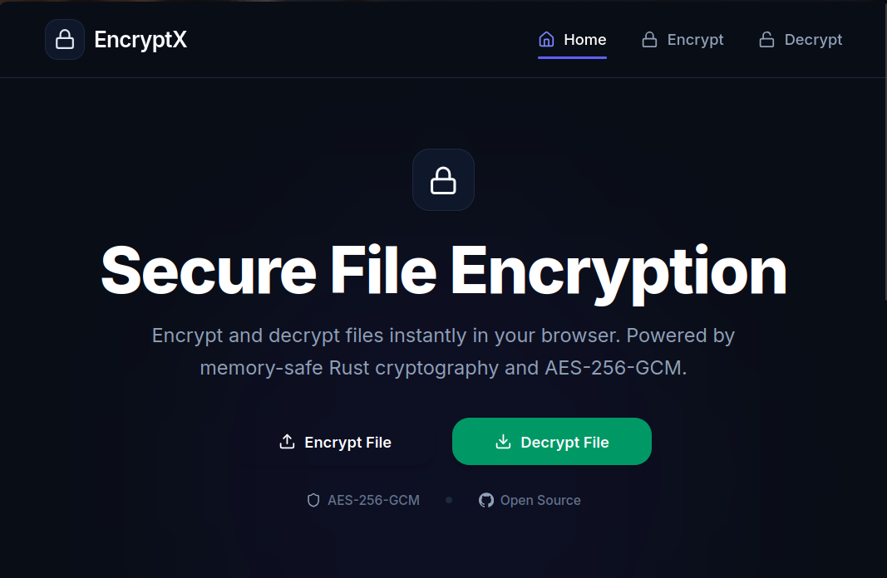
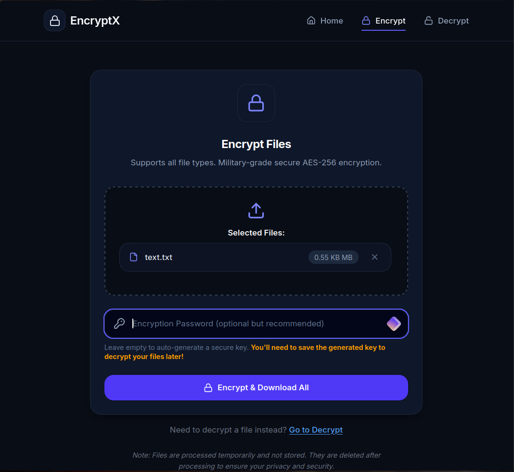
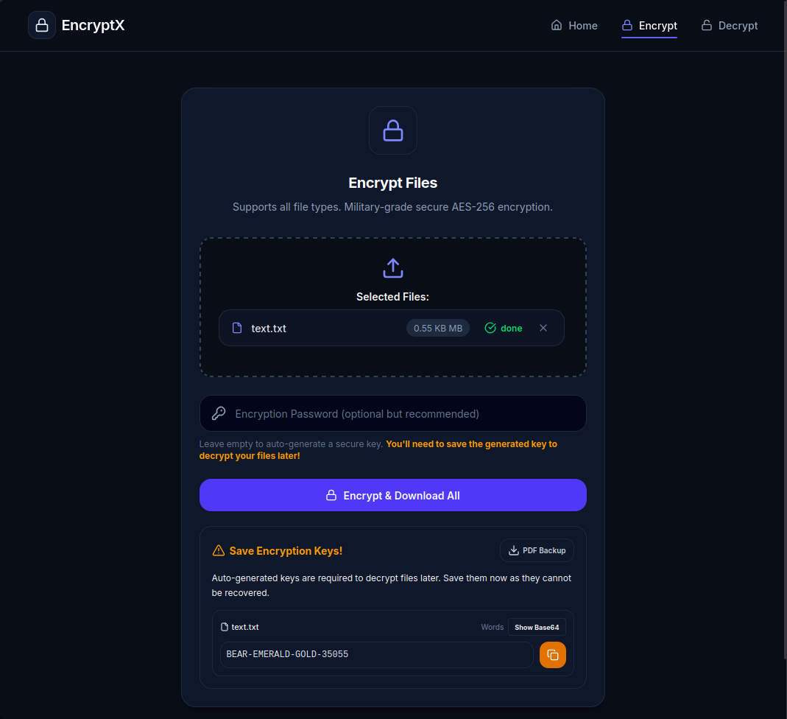
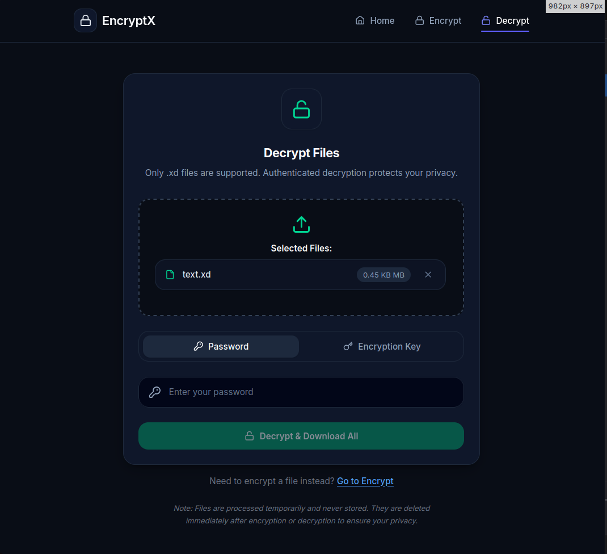
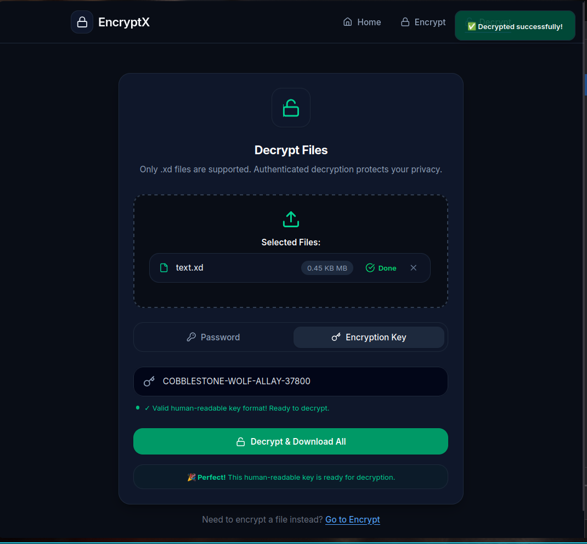

# 🔐 EncryptX (Archived & Unmaintained)

> [!IMPORTANT]
> **Archive Notice:** This project is archived and the author is no longer actively working on it. It was created purely as a personal learning experiment to explore Rust-based file cryptography, Next.js, and API development.

EncryptX is an educational file encryption utility providing a web interface and command-line access. It implements standard AES-256-GCM encryption for any file type, featuring automatic compression and dual encryption modes.

---

## ✨ Features

- 🔑 **Dual Encryption Methods**: Use a password or 256-bit encryption key.
- 🔐 **Standard Security**: AES-256-GCM ensures confidentiality and integrity.
- 🧠 **Argon2id Password Hashing**: Key derivation for password authentication.
- 🛡️ **Tamper Detection**: Authenticated encryption detects modification.
- 📂 **Any File Type**: Works for docs, media, archives, etc.
- 📦 **Automatic Compression**: Files are compressed with zstd before encryption for learning-based size reduction.
- 🖥️ **Subtle UI**: Built with Next.js + Tailwind, featuring drag & drop.
- 🧼 **Memory-Safe Backend**: Rust handles sensitive cryptographic materials securely.
- 🔒 **No Key Storage**: Keys are processed in-memory and never stored server-side.

---

## 📸 Screenshots

### 🏠 Home Page

*Modern interface with drag & drop file upload*

### 🔐 Encryption Process

*Secure file encryption with password or key-based options*


*Successful encryption with download ready*

### 🔓 Decryption Process

*Easy file decryption with original filename preservation*


*Successful decryption with original file restored*

---

## 🚀 Getting Started

### Prerequisites

- **Node.js** 18+ and **npm** (for frontend)
- **Rust** 1.70+ and **Cargo** (for backend)
- **Docker** (optional, for containerized deployment)

### Quick Start

#### 🐳 **Docker Setup** (Recommended for Quick Testing)

```bash
# Clone and start with Docker (fastest way)
git clone https://github.com/Amitminer/EncryptX.git
cd EncryptX
docker compose up --build
```

#### 🚀 **Development Setup** (Recommended for Development)

```bash
# Clone the repository
git clone https://github.com/Amitminer/EncryptX.git
cd EncryptX

# Install root dependencies
npm install

# Install frontend dependencies
cd encryptx-frontend && npm install && cd ..

# Start both backend and frontend simultaneously
npm run dev
```

#### 📱 **Manual Setup** (Alternative)

1. **Clone the repository**
   ```bash
   git clone https://github.com/Amitminer/EncryptX.git
   cd EncryptX
   ```

2. **Start the backend**
   ```bash
   cd encryptx-backend
   cargo run
   ```

3. **Start the frontend** (in a new terminal)
   ```bash
   cd encryptx-frontend
   npm install
   npm run dev
   ```

4. **Open your browser**
   ```
   http://localhost:3000
   ```

### Available Scripts

#### 🐳 **Docker Commands** (Simplest)

```bash
# Quick start with Docker
git clone https://github.com/Amitminer/EncryptX.git
cd EncryptX
docker compose up --build
```

#### 📦 **NPM Scripts** (Development)

The root `package.json` provides convenient scripts to manage both services:

```bash
# Development (runs both services with hot reload)
npm run dev

# Production build (builds both services)
npm run build

# Production start (runs both built services)
npm start

# Run tests (tests both services)
npm run test

# Individual service commands
npm run dev:backend      # Backend only
npm run dev:frontend     # Frontend only
npm run build:backend    # Build backend only
npm run build:frontend   # Build frontend only
npm run start:backend    # Start backend only
npm run start:frontend   # Start frontend only
npm run test:backend     # Test backend only
npm run test:frontend    # Test frontend only
```

### Docker Deployment

#### 🐳 **Quick Start with Docker**
```bash
# Development (default settings)
docker-compose up --build

# Production with custom environment
RUST_LOG=warn \
ALLOWED_ORIGIN=https://yourdomain.com \
NEXT_PUBLIC_BACKEND_URL=https://api.yourdomain.com \
NODE_ENV=production \
docker-compose up --build -d

# Common commands
docker-compose up -d --build    # Run in background
docker-compose logs -f          # View logs
docker-compose down             # Stop services
```

#### 🔧 **Individual Container Builds**
```bash
# Build backend (Alpine-based, ~50MB)
docker build -t encryptx-backend ./encryptx-backend

# Build frontend (Alpine-based with pnpm, ~150MB)
docker build -t encryptx-frontend ./encryptx-frontend

# Run individually
docker run -p 8080:8080 encryptx-backend
docker run -p 3000:3000 encryptx-frontend
```

---

## 🏗️ Architecture

### System Overview
```
[User/Browser] → [Next.js Frontend] → [Rust Backend API] → [Crypto Engine]
                        ↓                    ↓
[CLI User] ────────────────────────→ [Rust CLI] → [Crypto Engine]
                                           ↓
                                    [Encrypted .xd Files]
```

### Key Components
- **Crypto Engine** - Core AES-256-GCM encryption with Argon2id key derivation
- **Web API Server** - Actix Web REST endpoints for file upload/download
- **CLI Interface** - Command-line tool for direct file encryption/decryption
- **Frontend UI** - Next.js application with drag-and-drop file handling

---

## 📖 Usage

### Web Interface

1. **Encryption**:
   - Drag & drop files or click to browse
   - Enter a password (optional) or let the system generate a secure key
   - Click "Encrypt & Download" to get your `.xd` file

2. **Decryption**:
   - Upload your `.xd` file
   - Enter the password or key used for encryption
   - Download your original file

### Command Line Interface

#### 📦 **Pre-built Binaries** (Coming Soon)

Pre-built binaries will be available in future releases. For now, please build from source.

#### 🛠️ **Build from Source**

```bash
# Navigate to backend directory
cd encryptx-backend

# Encrypt with password
cargo run encrypt --file secret.txt --password mysecretpassword

# Encrypt with auto-generated key (key will be printed - save it!)
cargo run encrypt --file document.pdf

# Encrypt with custom key
cargo run encrypt --file data.zip --key YOUR_BASE64_KEY

# Specify output file and force overwrite
cargo run encrypt --file input.txt --password secret --output encrypted.xd --force

# Decrypt with password
cargo run decrypt --file secret.xd --password mysecretpassword

# Decrypt with key
cargo run decrypt --file document.xd --key YOUR_BASE64_KEY

# Specify output file and force overwrite
cargo run decrypt --file encrypted.xd --password secret --output decrypted.txt --force
```

---

## 🔧 API Reference

### Endpoints

| Method | Endpoint | Description |
|--------|----------|-------------|
| `POST` | `/encrypt` | Encrypt a file |
| `POST` | `/decrypt` | Decrypt a file |
| `GET` | `/health` | Health check |

### Headers

| Header | Description | Required |
|--------|-------------|----------|
| `x-password` | Password for encryption/decryption | Optional* |
| `x-enc-key` | Base64 encryption key | Optional* |
| `x-orig-filename` | Original filename | Recommended |

*Either `x-password` or `x-enc-key` must be provided for decryption

---

## 🛠️ Development

### Project Structure

```
EncryptX/
├── encryptx-backend/           # Rust backend (API + CLI)
│   ├── src/
│   │   ├── crypto/            # Core encryption/decryption logic
│   │   ├── cli/               # Command-line interface module
│   │   ├── service/           # Business logic layer
│   │   ├── validation/        # Input validation and security
│   │   ├── middleware/        # Security headers and CORS
│   │   ├── constants/         # Configuration constants
│   │   ├── main.rs            # Web server entry point
│   │   └── lib.rs             # Public API for library usage
│   ├── tests/                 # Integration tests
│   ├── Cargo.toml             # Rust dependencies and metadata
│   ├── Dockerfile             # Backend containerization
│   └── README.md              # Backend-specific documentation
├── encryptx-frontend/          # Next.js frontend
│   ├── src/app/               # Next.js 13+ app directory structure
│   │   ├── components/        # React components
│   │   ├── utils/             # Utility functions
│   │   └── types/             # TypeScript type definitions
│   ├── package.json           # Node.js dependencies
│   ├── Dockerfile             # Frontend containerization
│   └── README.md              # Frontend-specific documentation
├── docker-compose.yml         # Multi-service deployment configuration
├── .github/workflows/         # CI/CD automation
├── SECURITY.md                # Security policy and guidelines
└── README.md                  # This file
```

### Environment Variables

**Backend (.env)**
```bash
ALLOWED_ORIGIN=http://localhost:3000
RUST_LOG=info
```

**Frontend (.env)**
```bash
NEXT_PUBLIC_BACKEND_URL=http://localhost:8080
```

### Running Tests

```bash
# Run all tests (both backend and frontend)
npm run test

# Or run individually:
npm run test:backend     # Rust tests with cargo
npm run test:frontend    # Frontend tests with npm

# Manual testing:
cd encryptx-backend
cargo test
cargo clippy --all-targets --all-features -- -D warnings

cd encryptx-frontend
npm test
```

---

## 🔒 Security

Security is our top priority. EncryptX implements:

- **AES-256-GCM** authenticated encryption
- **Argon2id** password-based key derivation (64MB memory, GPU-resistant)
- **Rate limiting** (10 requests/minute per IP)
- **Input validation** and sanitization
- **Security headers** (CSP, HSTS, X-Frame-Options, etc.)
- **Memory-safe** key handling with automatic cleanup

⚠️ **Important**: Keys are never stored server-side. If you lose your password or key, your data cannot be recovered.

For detailed security information, see [SECURITY.md](SECURITY.md).

---

## 🚀 Deployment

### Production Environment

1. **Environment Setup**
   ```bash
   # Backend
   export ALLOWED_ORIGIN=https://yourdomain.com
   export RUST_LOG=warn

   # Frontend
   export NEXT_PUBLIC_BACKEND_URL=https://api.yourdomain.com
   ```

2. **Build for Production**
   ```bash
   # Backend
   cd encryptx-backend
   cargo build --release

   # Frontend
   cd encryptx-frontend
   npm run build
   ```

3. **Deploy with Docker**
   ```bash
   docker-compose -f docker-compose.prod.yml up -d
   ```

### Hosting Platforms

| Component | Recommended Platforms |
|-----------|----------------------|
| Backend | Railway, Fly.io, DigitalOcean |
| Frontend | Vercel, Netlify, Cloudflare Pages |
| Database | Not required (stateless) |

---

## 🧪 Technology Stack

### Backend
| Technology | Purpose |
|------------|---------|
| **Rust** | Memory-safe systems programming |
| **Actix Web** | High-performance async web framework |
| **AES-GCM** | Authenticated encryption |
| **Argon2id** | Password-based key derivation |
| **zstd** | Fast compression algorithm |

### Frontend
| Technology | Purpose |
|------------|---------|
| **Next.js 15** | React framework with SSR |
| **TypeScript** | Type-safe JavaScript |
| **Tailwind CSS** | Utility-first CSS framework |
| **React Dropzone** | File upload interface |

### DevOps
| Technology | Purpose |
|------------|---------|
| **Docker** | Containerization |
| **GitHub Actions** | CI/CD pipeline |
| **BetterUptime** | Monitoring |

---

## 🤝 Contributing

We welcome contributions! Please see our [Contributing Guidelines](CONTRIBUTING.md) for details.

### Development Workflow

1. Fork the repository
2. Create a feature branch (`git checkout -b feature/amazing-feature`)
3. Make your changes
4. Run tests (`cargo test` and `npm test`)
5. Commit your changes (`git commit -m 'Add amazing feature'`)
6. Push to the branch (`git push origin feature/amazing-feature`)
7. Open a Pull Request

### Code Style

- **Rust**: Follow `rustfmt` and `clippy` recommendations
- **TypeScript**: Follow Prettier and ESLint configurations
- **Commits**: Use conventional commit messages

---

## 📊 Performance

- **Encryption Speed**: ~100MB/s on modern hardware
- **Compression Ratio**: 20-60% size reduction (varies by file type)
- **Memory Usage**: <64MB per encryption operation
- **File Size Limit**: 1GB maximum
- **Concurrent Users**: Scales with available system resources

---

## 🐛 Troubleshooting

### Common Issues

**Backend won't start**
```bash
# Check Rust installation
rustc --version
cargo --version

# Update dependencies
cargo update
```

**Frontend build fails**
```bash
# Clear cache and reinstall
rm -rf node_modules package-lock.json
npm install
```

**CORS errors**
```bash
# Check environment variables
echo $ALLOWED_ORIGIN
echo $NEXT_PUBLIC_BACKEND_URL
```

### Getting Help

- 📖 Check our [Documentation](docs/)
- 🐛 Report bugs in [Issues](https://github.com/Amitminer/EncryptX/issues)
- 💬 Join discussions in [Discussions](https://github.com/Amitminer/EncryptX/discussions)
- 🔒 Security issues: See [SECURITY.md](SECURITY.md)

---

## 📄 License

This project is licensed under the [MIT License](LICENSE).
© 2025 [AmitxD](https://github.com/Amitminer)

---

## 🙏 Acknowledgments

- **Rust Community** for excellent cryptographic libraries
- **Next.js Team** for the amazing React framework
---

<div align="center">

**Made with ❤️ by [AmitxD](https://github.com/Amitminer)**

[⭐ Star this repo](https://github.com/Amitminer/EncryptX) • [🐛 Report Bug](https://github.com/Amitminer/EncryptX/issues) • [✨ Request Feature](https://github.com/Amitminer/EncryptX/issues)

</div>
